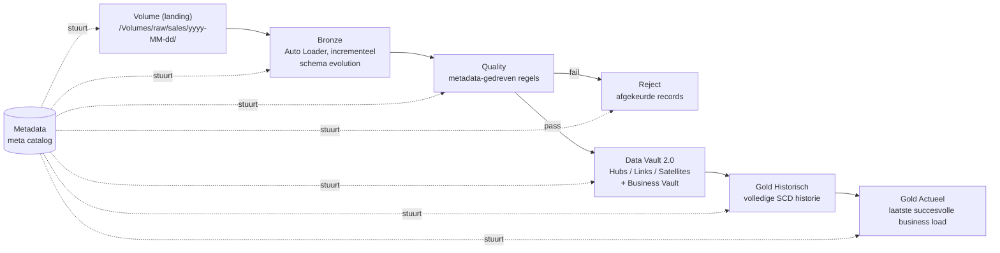

# Contoso Lakehouse v2 — Metadata-gedreven Databricks Lakehouse

Metadata-gedreven Lakehouse architectuur op Databricks (Unity Catalog + Delta Lake)
voor de Contoso datamarts (Sales: Orders, Customers, Products).

## Architectuurlagen



| Laag | Catalog.Schema | Doel |
|---|---|---|
| Volume (landing) | `raw.sales` (volume `landing`) | Onbewerkte parquet leveringen per datumfolder |
| Bronze | `contoso_bronze.sales` | 1:1 kopie van de bron + technische kolommen, incrementeel via Auto Loader |
| Quality | `contoso_quality.sales` | Gevalideerde ("passed") records + `dq_result` audit |
| Reject | `contoso_reject.sales` | Afgekeurde records met regel-context |
| Data Vault | `contoso_vault.raw_vault` / `contoso_vault.business_vault` | Hubs, Links, Satellites, PIT/Bridge |
| Gold Historisch | `contoso_gold.historical` | Dimensies/feiten met volledige SCD2 historie |
| Gold Actueel | `contoso_gold.current` | Snapshot van de laatst succesvolle business load |
| Metadata | `contoso_meta.metadata` | Control framework (bron, mapping, DQ, DV, runs, status) |

## Kernprincipes

1. **Alles is Delta.** Elke laag is een managed Delta tabel in Unity Catalog.
2. **Geen hardcoded pipelines.** Bronobjecten, laadstrategie, afhankelijkheden,
   kwaliteitsregels, bron-doel mappings en Data Vault mappings staan in metadata.
3. **Levering = datumfolder.** Orders, Customers en Products in
   `/Volumes/raw/sales/<yyyy-MM-dd>/` vormen samen één logische levering (`delivery_id`).
4. **Gate op leveringsniveau.** Vervolgverwerking start pas wanneer *alle* verplichte
   objecten van dezelfde datumfolder succesvol in Bronze staan
   (`meta.fn_delivery_is_complete`).
5. **Gold Actueel is atomair.** Een nieuwe versie wordt pas zichtbaar na een volledig
   succesvolle run; bij falen blijft de vorige versie actief (publish-by-pointer).

## Repository structuur

```
.
├── README.md
├── databricks.yml              # Databricks Asset Bundle
├── docs/                       # Architectuur- en ontwerpdocumentatie
│   ├── 00_besluitenlog.md      # Verslag van de sessie en alle ontwerpbesluiten
│   ├── 01_architecture.md
│   ├── 02_metadata_model.md
│   ├── 03_unity_catalog.md
│   ├── 04_data_vault.md
│   └── 05_workflow_design.md
├── sql/
│   ├── 00_unity_catalog/       # Catalogs, schemas, volumes, grants
│   ├── 01_metadata/            # Metadata model + audit model
│   ├── 02_bronze/              # Bronze Delta tabellen
│   ├── 03_quality_reject/      # Quality + Reject tabellen
│   ├── 04_data_vault/          # Raw Vault + Business Vault
│   └── 05_gold/                # Gold Historisch + Gold Actueel
├── metadata/seed/              # Seed-data (JSON) voor het metadata model
├── src/contoso_lakehouse/      # Herbruikbaar, metadata-gedreven Python framework
├── notebooks/                  # Databricks notebooks (thin wrappers om het framework)
├── workflows/                  # Job definities
└── tests/                      # Metadata-consistentietests
```

## Deploy

```bash
# 0. Metadata-consistentie lokaal controleren
pytest -q

# 1. Unity Catalog + metadata objecten
databricks bundle deploy -t dev

# 2. Eenmalige setup + metadata seed
databricks bundle run setup_lakehouse -t dev

# 3. Continue pipeline
databricks bundle run contoso_lakehouse_pipeline -t dev
```

Zie [docs/05_workflow_design.md](docs/05_workflow_design.md) voor de orchestratie
en [docs/00_besluitenlog.md](docs/00_besluitenlog.md) voor de onderbouwing van de
ontwerpkeuzes.
