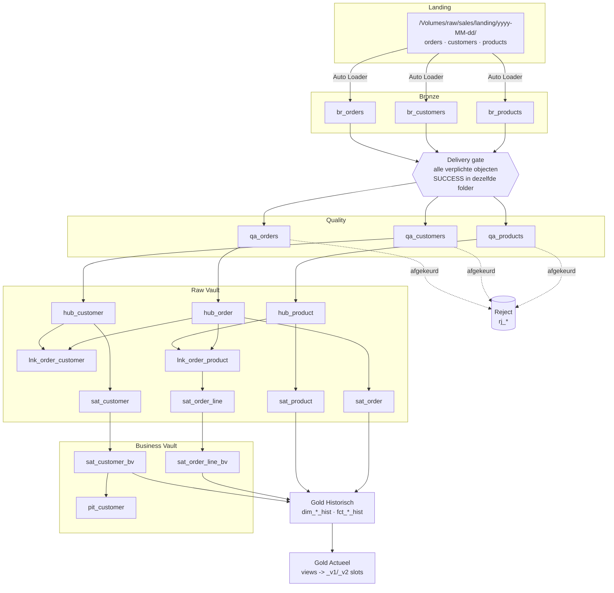

# Architectuur

## Lagen en dataflow

## Laagverantwoordelijkheden

| Laag | Doel | Wat er níét gebeurt |
|---|---|---|
| **Volume** | Onbewerkte bestanden bewaren; één datumfolder = één levering | Geen transformatie, geen validatie |
| **Bronze** | 1:1 opslag + technische kolommen; incrementeel via Auto Loader met schema evolution | Geen typering, geen filtering, geen deduplicatie |
| **Quality** | Typeren en valideren volgens `meta_mapping` en `meta_quality_rule` | Geen businesslogica, geen joins tussen entiteiten |
| **Reject** | Afgekeurde records met alle faalredenen en de originele payload | Geen automatische correctie |
| **Raw Vault** | Historisatie zonder interpretatie (DV2.0) | Geen berekeningen, geen businessregels |
| **Business Vault** | Afgeleide attributen, PIT en Bridge | Geen presentatielogica |
| **Gold Historisch** | Dimensioneel model met volledige SCD2 historie | Geen filtering op actualiteit |
| **Gold Actueel** | Snapshot van de laatste succesvolle business load | Geen historie |

## Technische kolommen

Elke laag draagt een vaste set technische kolommen zodat herkomst en run altijd
te herleiden zijn.

| Kolom | Bronze | Quality | Vault | Gold Hist | Gold Actueel |
|---|:-:|:-:|:-:|:-:|:-:|
| `_delivery_id` / `_delivery_date` | ✓ | ✓ | | | |
| `_batch_id` | ✓ | ✓ | ✓ | ✓ | ✓ |
| `_record_source` / `record_source` | ✓ | ✓ | ✓ | ✓ | |
| `load_date` | | | ✓ | | |
| `_source_file_*` | ✓ | | | | |
| `_rescued_data` | ✓ | | | | |
| `_quality_status` / `_warning_codes` | | ✓ | | | |
| `valid_from` / `valid_to` / `is_current` | | | via view | ✓ | |
| `_as_of_delivery_id` / `_as_of_timestamp` | | | | | ✓ |

## Fouttolerantie

| Scenario | Gedrag |
|---|---|
| Eén bestand ontbreekt in de levering | Gate blijft dicht; vervolgstappen worden overgeslagen (`SKIPPED`), geen halve mart |
| Nieuwe kolom in de bron | Stream faalt bewust, retry pikt het nieuwe schema op; kolom komt in Bronze, niet in Gold |
| Type-wijziging in de bron | Waarde landt in `_rescued_data`; DQ-signaal op rescued data |
| DQ-drempel overschreden | Batch faalt (`FAIL_BATCH`); Quality-tabel blijft ongewijzigd |
| Data Vault load faalt | Idempotente herstart op `_batch_id`; geen dubbele rijen |
| Gold Actueel bouw faalt | Niets gepubliceerd; vorige versie blijft actief en consistent |
| Herstart na storing | Leveringen worden chronologisch ingehaald op volgnummer |
