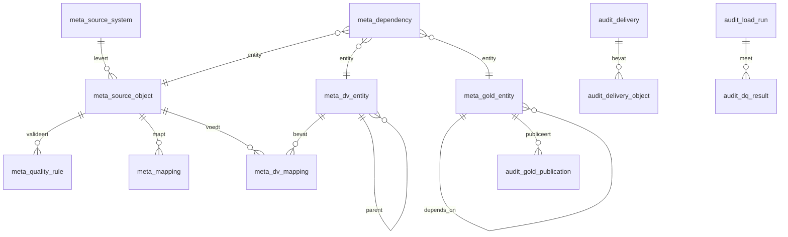

# Metadata model

Alle ETL-logica wordt hier geconfigureerd. Geen enkel notebook of workflow-bestand
bevat kennis van bronobjecten, mappings, regels of afhankelijkheden.

## Configuratietabellen (`contoso_meta_<env>.metadata`)

| Tabel | Rol | Sleutel |
|---|---|---|
| `meta_source_system` | Bronsysteem + landingconventie | `source_system_id` |
| `meta_source_object` | Bronobject, laadstrategie, Auto Loader config, doellocaties | `source_object_id` |
| `meta_dependency` | Afhankelijkheidsgraaf over alle lagen | `dependency_id` |
| `meta_quality_rule` | Declaratieve kwaliteitsregels | `rule_id` |
| `meta_mapping` | Bron-doel mapping op kolomniveau | `mapping_id` |
| `meta_dv_entity` | Hub / Link / Satellite / PIT definities | `dv_entity_id` |
| `meta_dv_mapping` | Kolommapping Quality → Data Vault, incl. hashdiff-scope | `dv_mapping_id` |
| `meta_gold_entity` | Gold Historisch en Gold Actueel entiteiten | `gold_entity_id` |

## Audittabellen (`contoso_meta_<env>.audit`)

| Tabel / view | Rol |
|---|---|
| `audit_delivery` | Eén rij per logische levering, met volgnummer en status |
| `audit_delivery_object` | Bronze laadstatus per object per levering |
| `audit_load_run` | Uitvoeringslog van elke stap in elke laag |
| `audit_dq_result` | Meetresultaat per kwaliteitsregel per run |
| `audit_gold_publication` | Welk fysiek slot van Gold Actueel actief is |
| `v_delivery_readiness` | **Gate:** is een levering compleet? |
| `v_next_processable_delivery` | **Gate:** welke levering is als eerste aan de beurt? |
| `v_active_gold_publication` | Laatste succesvolle publicatie per Gold entiteit |

## Belangrijke velden

### Laadstrategie (`meta_source_object.load_strategy`)

| Waarde | Betekenis | Status |
|---|---|---|
| `INCREMENTAL_APPEND` | Alleen nieuwe records toevoegen (Orders) | Geïmplementeerd |
| `INCREMENTAL_MERGE` | Upsert op business key | Geïmplementeerd |
| `SNAPSHOT_SCD2` | Volledige snapshot; wijzigingen worden gehistoriseerd (Customers, Products) | Geïmplementeerd |
| `FULL_OVERWRITE` | Volledig vervangen | Geïmplementeerd |
| `INCREMENTAL_CDC` | Change feed met I/U/D | Openstaand |
| `PARTIAL_SNAPSHOT` | Deelsnapshot; ontbrekende sleutels zijn géén delete | Openstaand |

### Afhankelijkheidstype (`meta_dependency.dependency_type`)

| Waarde | Betekenis |
|---|---|
| `DELIVERY_COMPLETE` | Wacht tot alle verplichte objecten van de levering geladen zijn |
| `UPSTREAM_SUCCESS` | Wacht tot een specifieke entiteit binnen dezelfde batch geslaagd is |
| `SAME_DELIVERY` | Beide entiteiten moeten dezelfde `delivery_id` verwerken |

### Kwaliteitsregels

| Veld | Betekenis |
|---|---|
| `rule_expression` | Spark SQL boolean expressie; `TRUE` = record voldoet |
| `evaluation_scope` | `ROW` (per rij) · `DATASET` (window/aggregatie) · `CROSS_DATASET` (join) |
| `severity` | `ERROR` → reject · `WARNING` → doorlaten met vlag |
| `threshold_pct` | Maximaal toegestaan percentage afgekeurde records |
| `on_threshold_breach` | `FAIL_BATCH` · `QUARANTINE_BATCH` · `WARN_ONLY` |

### Data Vault kolomrollen (`meta_dv_mapping.column_role`)

`HASH_KEY` · `BUSINESS_KEY` · `HASHDIFF` · `DESCRIPTIVE` · `DEGENERATE` ·
`DRIVING_KEY` · `LOAD_DATE` · `RECORD_SOURCE`

`is_in_hashdiff` bepaalt de hashdiff-scope. Een wijziging in de **volgorde** van
`ordinal_position` verandert de hashdiff en veroorzaakt onterechte nieuwe
satellite-versies.

## Een nieuw bronobject toevoegen

Geen codewijziging nodig — alleen metadata:

1. Rij toevoegen aan `meta_source_object.json` (laadstrategie, doellocaties, checkpointpaden).
2. `meta_mapping.json` aanvullen met de QUALITY-kolommen.
3. `meta_quality_rule.json` aanvullen met de regels.
4. `meta_dv_entity.json` / `meta_dv_mapping.json` aanvullen met hub/link/satellite.
5. `meta_dependency.json` aanvullen met de gate en de upstream-afhankelijkheden.
6. `pytest` draaien (consistentiechecks) en `bundle run setup_lakehouse` uitvoeren.

Het validatienotebook compileert daarna elke expressie met `EXPLAIN` voordat de
eerste productierun start.
