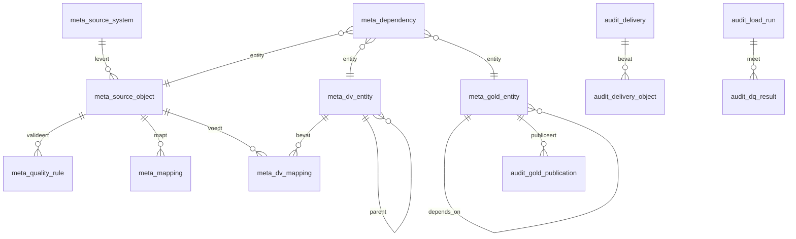

# Metadata model

Alle ETL-logica wordt hier geconfigureerd. Geen enkel notebook of workflow-bestand
bevat kennis van bronobjecten, mappings, regels of afhankelijkheden.

## Configuratietabellen (`contoso_meta_<env>.metadata`)

| Tabel | Rol | Sleutel |
|---|---|---|
| `meta_source_system` | Bronsysteem + landingconventie | `source_system_id` |
| `meta_source_object` | Bronobject, route, laadstrategie, Auto Loader config, doellocaties | `source_object_id` |
| `meta_dependency` | Afhankelijkheidsgraaf over alle lagen | `dependency_id` |
| `meta_quality_rule` | Declaratieve kwaliteitsregels | `rule_id` |
| `meta_mapping` | Bron-doel mapping op kolomniveau | `mapping_id` |
| `meta_dv_entity` | Hub / Link / Satellite / PIT definities | `dv_entity_id` |
| `meta_dv_mapping` | Kolommapping Quality → Data Vault, incl. hashdiff-scope | `dv_mapping_id` |
| `meta_gold_entity` | Gold Historisch en Actueel, gebonden aan een bronsysteem/data product | `gold_entity_id` |
| `meta_retry_policy` | Referentietabel voor retry- en prioriteitsbeleid; voorkomt duplicatie in `meta_dependency` | `retry_policy_id` |
| `meta_schema_drift_approval` | Goedkeuringsworkflow voor schema-drift per bronobject | `approval_id` |
| `meta_table_maintenance_policy` | Overervend Delta-onderhoudsbeleid per catalog, schema of tabel | `policy_id` |
| `meta_data_governance_policy` | Eigenaarschap, classificatie, retentie en SLA per bronsysteem | `source_system_id` |
| `meta_gold_data_product` | Consumercontract, ownership en compatibiliteit per Gold-publicatiegroep | `publication_group_id` |

## Audittabellen (`contoso_meta_<env>.audit`)

| Tabel / view | Rol |
|---|---|
| `audit_delivery` | Eén rij per logische levering, met volgnummer en status |
| `audit_delivery_object` | Bronze laadstatus per object per levering |
| `audit_delivery_manifest` | Bronverklaring dat een delivery volledig en atomisch is gepubliceerd |
| `audit_delivery_state_transition` | Append-only historie van toegestane delivery-statusovergangen |
| `audit_work_item` | Persistente queue per delivery, laag en entiteit met retry- en lease-status |
| `audit_load_run` | Uitvoeringslog van elke stap in elke laag |
| `audit_dq_result` | Meetresultaat per kwaliteitsregel per run |
| `audit_gold_publication` | Welk fysiek slot van Gold Actueel actief is |
| `v_delivery_readiness` | **Gate:** is een levering compleet? |
| `v_next_processable_delivery` | **Gate:** welke levering is als eerste aan de beurt? |
| `v_active_gold_publication` | Laatste succesvolle publicatie per Gold entiteit |

### Delivery-manifest (`audit_delivery_manifest`)

Elke delivery heeft precies één centraal manifest. Een extract- of generatorpad
sluit dit pas nadat staging atomisch naar de definitieve delivery-folder is
verplaatst. De gate opent uitsluitend wanneer het manifest `CLOSED` is, de
verwachte object- en bestandsaantallen consistent zijn en bij
`absence_means_delete = true` de delivery als volledige snapshot is gemarkeerd.
Een `_manifest.json` in Landing is het fysieke bewijs; de audittabel is het
transactionele besturingscontract voor Databricks Workflows.

### Control plane voor uitvoering en herstel

`audit_delivery_state_transition` bewaakt de delivery state machine. Overgangen
naar `SUPERSEDED` en een vrijgave van `QUARANTINED` naar `COMPLETE` vereisen een
reden en approval-reference. De remediation-notebooks gebruiken uitsluitend dit
centrale contract.

`audit_work_item` beheert een uitvoerbare stap per delivery, laag en entiteit.
Een deliverygebonden run plant en claimt het work-item idempotent met een lease
van vier uur. Bij falen volgt een vertraagde retry; na het ingestelde maximum
wordt de stap `DEAD_LETTER`. Bronze blijft uitgezonderd omdat een Auto Loader
microbatch meerdere deliveries kan bevatten.

Een `DEAD_LETTER` work-item wordt uitsluitend via de remediationworkflow
heropend. `audit_work_item_transition` bewaart de append-only overgang naar
`PENDING`, inclusief actor, reden en approval-reference. De operator herplant
alleen; de volgende pipeline-run claimt en voert het work-item uit.

### Onderhoudsbeleid (`meta_table_maintenance_policy`)

Onderhoud wordt niet per script of handmatige tabellijst beheerd. Een policy
geldt voor een catalog en kan later op schema- of tabelniveau worden
overschreven. De policy bepaalt onderhoudstier, optimalisatiemodus,
minimumaantal files, interval en veilige VACUUM-retentie. De planner schrijft
elke run naar `audit_maintenance_run` en iedere geplande, overgeslagen,
uitgevoerde of gefaalde actie naar `audit_maintenance_action`.

### Datagovernance per bron (`meta_data_governance_policy`)

Iedere actieve bron heeft één policy met `data_owner`, `data_steward`,
`data_domain`, `pii_classification`, `retention_days`, `cost_center` en
`sla_tier`. De lokale release-gate weigert een actieve bron zonder policy,
ongeldige classificatie, onbekende SLA-tier of niet-positieve retentie.
Productiemetadata blijft schrijfbaar uitsluitend voor de deployment identity;
data engineers hebben leesrechten voor onderzoek en ontwikkeling.

### Gold data-productcontract (`meta_gold_data_product`)

Iedere actieve `CURRENT`-publicatiegroep heeft één contract met productnaam,
owner, steward, consumer group, refresh-SLA en compatibiliteitsbeleid. De
release-gate weigert een actieve Gold-publicatiegroep zonder contract of met
een ongeldige SLA of compatibiliteitsstrategie. Gold wordt daarmee expliciet
als consumercontract beheerd, niet alleen als technische output.

## Belangrijke velden

### Laadstrategie (`meta_source_object.load_strategy`)

| Waarde | Betekenis | Status |
|---|---|---|
| `INCREMENTAL_APPEND` | Alleen nieuwe records toevoegen (Orders) | Geïmplementeerd |
| `INCREMENTAL_MERGE` | Upsert op business key | Geïmplementeerd |
| `SNAPSHOT_SCD2` | Volledige snapshot; wijzigingen worden gehistoriseerd (Customers, Products) | Geïmplementeerd |
| `FULL_OVERWRITE` | Volledig vervangen | Geïmplementeerd |
| `INCREMENTAL_CDC` | Change feed met I/U/D; deletes landen als `_cdc_op='D'` in Bronze, SCD2-resolutie downstream | Geïmplementeerd |
| `PARTIAL_SNAPSHOT` | Deelsnapshot; ontbrekende sleutels zijn géén delete (volgt `absence_means_delete=false`) | Geïmplementeerd |

### Delete-semantiek en contract (`meta_source_object`)

| Veld | Betekenis |
|---|---|
| `delete_semantics` | `NONE` · `SOFT_DELETE_FLAG` · `HARD_DELETE` — hoe verwijderingen herkend worden |
| `absence_means_delete` | Bij volledige snapshots: ontbrekende sleutel = delete. Alleen `true` bij gecureerde volledige sets |
| `schema_contract_version` | Expliciet contract met de bronleverancier; drift is een contractbreuk |
| `late_arrival_window_days` | Hoeveel dagen terug correcties nog geaccepteerd worden |
| `freshness_sla_hours` | Verse-data-SLA voor gate-timeout en alerting |
| `backfill_strategy` | Strategie voor initiële historische lading (`FULL_RELOAD`) |

### Verwerkingsroute (`meta_source_object.processing_route`)

| Waarde | Route na Quality | Gebruik |
|---|---|---|
| `RAW_VAULT` | Raw Vault -> Business Vault -> Gold | Bedrijfsentiteiten, transacties en zelfstandige historische feiten |
| `REFERENCE_DATA` | Versioned reference table in Business Vault -> Gold | Code-, classificatie- en verrijkingssets, zoals ECB-wisselkoersen en Nager-feestdagen |

De route wordt **per bronobject** gekozen. Bestaande objecten krijgen bij het
seeden standaard `RAW_VAULT`. Een `REFERENCE_DATA`-object vereist
`reference_catalog`, `reference_schema` en `reference_table`; de loader bewaart
daar een SCD2-achtige referentiehistorie op business key en change-trackingkolommen.

### Gold-bronbinding (`meta_gold_entity.source_system_id`)

Elke Gold-entiteit is gebonden aan één bronsysteem of data product. Historische
en actuele Gold-loads verwerken uitsluitend entiteiten met dezelfde
`source_system_id` als de actieve delivery. Een publication group mag geen
entiteiten van meerdere bronsystemen bevatten; de metadata-validatie blokkeert
die configuratiefout vóór uitvoering.

### Fysieke organisatie (`meta_gold_entity`)

| Veld | Betekenis |
|---|---|
| `partition_columns` | Partitie op datumkolommen voor feiten (bijv. `order_date`) — eerste orde filter |
| `cluster_columns` | Liquid clustering op hash-keys (bijv. `customer_hk`) — incrementeel, MERGE-vriendelijk |

Liquid clustering vervangt het eerdere ZORDER: bij hoge-cardinaliteit hash-keys
en frequente MERGE's degenereert ZORDER snel en vereist dure volledige
`OPTIMIZE`-herschikkingen. Clustering is incrementeel en blijft effectief bij
doorlopende inserts. Kleine referentietabellen gebruiken bewust géén clustering.

### Afhankelijkheidstype (`meta_dependency.dependency_type`)

| Waarde | Betekenis |
|---|---|
| `DELIVERY_COMPLETE` | Wacht tot alle verplichte objecten van de levering geladen zijn |
| `UPSTREAM_SUCCESS` | Wacht tot een specifieke entiteit binnen dezelfde batch geslaagd is |
| `SAME_DELIVERY` | Beide entiteiten moeten dezelfde `delivery_id` verwerken |

### Kwaliteitsregels

| Veld | Betekenis |
|---|---|
| `rule_expression` | Spark SQL boolean expressie; `TRUE` = record voldoet |
| `evaluation_scope` | `ROW` (per rij) · `DATASET` (window/aggregatie) · `CROSS_DATASET` (join) |
| `severity` | `ERROR` → reject · `WARNING` → doorlaten met vlag |
| `threshold_pct` | Maximaal toegestaan percentage afgekeurde records |
| `on_threshold_breach` | `FAIL_BATCH` · `QUARANTINE_BATCH` · `WARN_ONLY` |

### Data Vault kolomrollen (`meta_dv_mapping.column_role`)

`HASH_KEY` · `BUSINESS_KEY` · `HASHDIFF` · `DESCRIPTIVE` · `DEGENERATE` ·
`DRIVING_KEY` · `LOAD_DATE` · `RECORD_SOURCE`

`is_in_hashdiff` bepaalt de hashdiff-scope. Een wijziging in de **volgorde** van
`ordinal_position` verandert de hashdiff en veroorzaakt onterechte nieuwe
satellite-versies.

## Een nieuw bronobject toevoegen

Geen codewijziging nodig — alleen metadata:

1. Rij toevoegen aan `meta_source_object.json` (laadstrategie, doellocaties, checkpointpaden).
2. `meta_mapping.json` aanvullen met de QUALITY-kolommen.
3. `meta_quality_rule.json` aanvullen met de regels.
4. `meta_dv_entity.json` / `meta_dv_mapping.json` aanvullen met hub/link/satellite.
5. `meta_dependency.json` aanvullen met de gate en de upstream-afhankelijkheden.
6. `pytest` draaien (consistentiechecks) en `bundle run setup_lakehouse` uitvoeren.

Het validatienotebook compileert daarna elke expressie met `EXPLAIN` voordat de
eerste productierun start.
