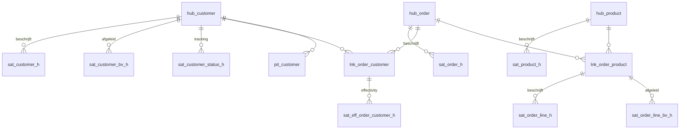

# Data Vault 2.0 ontwerp

## Model



## Hash keys

Vastgelegd in [src/contoso_lakehouse/hashing.py](../src/contoso_lakehouse/hashing.py),
conventieversie 1:

```
sha2(concat(
      coalesce(nullif(upper(trim(cast(<collision_code> as string))), ''), '^^'),
      '||',
      coalesce(nullif(upper(trim(cast(<bk1> as string))), ''), '^^'),
      ...
    ), 256)
```

- **SHA-256**, niet MD5: collisierisico bij miljarden rijen.
- **`bk_collision_code`** (het bronsysteem) zit in elke hub-hash. Daardoor botsen
  klantnummers uit CRM, ERP en webshop niet — noodzakelijk voor multi-source hubs.
- **Volgorde is betekenisvol.** Wijzigen van de kolomvolgorde of de conventie
  vereist een volledige rebuild van de vault.

## Historisatie: insert-only satellites

Fysieke end-dating vraagt UPDATEs op historische rijen; in Delta betekent dat het
herschrijven van bestaande parquet-bestanden bij elke load. Daarom:

| Object | Rol |
|---|---|
| `sat_customer_h` | Fysiek, insert-only. Alleen `load_date`, geen `load_end_date`. |
| `sat_customer` (view) | Voegt `load_end_date` en `is_current` toe via `LEAD(load_date)`. Dit is het contract voor Gold. |

Een nieuwe satellite-rij wordt alleen weggeschreven als de `hashdiff` afwijkt van
de laatst bekende versie voor dezelfde hash key.

## Delete-detectie

Bij `SNAPSHOT_SCD2`-bronnen verdwijnt een verwijderde sleutel simpelweg uit de
levering. Dat wordt afgevangen met:

| Object | Werking |
|---|---|
| `sat_customer_status_h` | Record-tracking satellite: `I` (nieuw), `U` (aanwezig), `D` (afwezig in de snapshot) |
| `is_deleted` in `sat_customer_h` | Expliciete logische delete uit de bron |

## Effectivity

`sat_eff_order_customer_h` bewaakt dat per order maximaal één klantrelatie geldig
is (`hk_order` als driving key). Zonder deze satellite zou een order die naar een
andere klant wordt overgeboekt twee actieve links opleveren.

> Status: de tabel bestaat, de loadlogica voor het driving-key-patroon staat nog open.

## Business Vault

| Satellite | Afgeleide attributen |
|---|---|
| `sat_customer_bv_h` | `full_address`, `customer_type` (B2B/B2C), `tenure_band`, `is_contactable` |
| `sat_order_line_bv_h` | `gross_amount`, `net_amount_calc`, `discount_rate`, `lead_time_days`, `is_cancelled` |

Alle berekeningen staan als SQL-expressie in `meta_dv_mapping.source_expression`;
er is geen berekening in Python of in een notebook.

## PIT

`pit_customer` bevat per `hk_customer` en snapshotmoment de bijbehorende
`load_date` van `sat_customer` en `sat_customer_bv`. Dat vervangt de dure
range-joins tussen satellites in de Gold-queries.

## Idempotentie

Elke load verwijdert eerst de rijen van de eigen `_batch_id` en schrijft daarna.
Een herstart van een gefaalde run levert daardoor geen dubbele rijen op.
