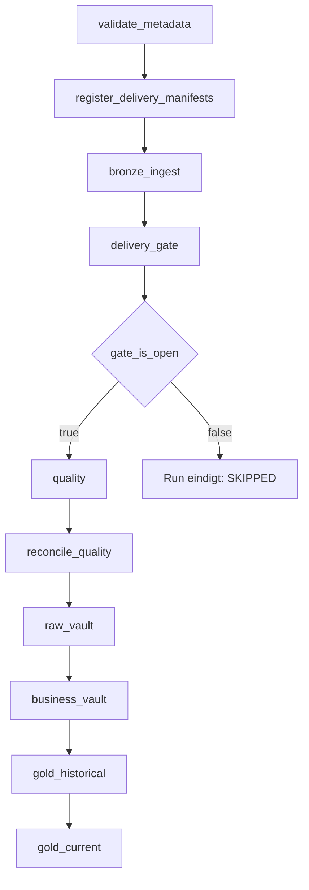
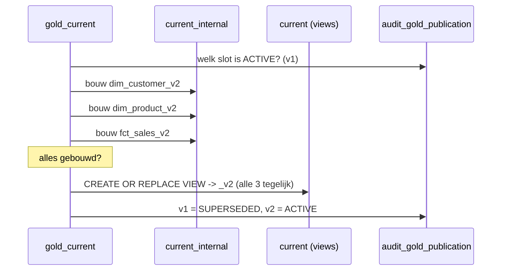

# Workflow design

## Uitgangspunt

De Workflow-graaf bevat **geen inhoudelijke afhankelijkheden**. De taken vormen
alleen de lagen. Welke entiteiten binnen een laag draaien en in welke volgorde,
komt uit `meta_dependency`. Een nieuw bronobject of een nieuwe satellite vereist
dus geen wijziging in [workflows/pipeline.job.yml](../workflows/pipeline.job.yml).

## Metadata release-gate

Vóór `databricks bundle deploy` draait CI `python -m
contoso_lakehouse.release_check` gevolgd door `pytest -q`. De eerste check
valideert de complete Git-seedrelease zonder Spark: JSON-structuur, unieke
sleutels, dependency-verwijzingen en veilige onderhoudspolicies. Notebook 99
blijft de tweede gate in Databricks en compileert daarna de runtime-expressies
tegen de feitelijke Unity Catalog-tabellen.

## Taakgraaf



| Taak | Notebook | Verantwoordelijkheid |
|---|---|---|
| `validate_metadata` | 99 | Cycli, wees-verwijzingen en compileerbaarheid van alle expressies |
| `register_delivery_manifests` | 04 | Valideert en registreert gesloten rootmanifests van push-bronnen |
| `bronze_ingest` | 10 | Auto Loader per bronobject; `max_retries: 3` wegens schema evolution |
| `delivery_gate` | 05 | Bepaalt de eerstvolgende complete levering; zet `gate_open` en `delivery_id` als taskValue |
| `gate_is_open` | — | `condition_task`; blokkeert alles wat volgt als de levering niet compleet is |
| `quality` | 20 | DQ-regels in één pass; passed → Quality, failed → Reject |
| `reconcile_quality` | 21 | Bewijst Bronze = Quality + Reject per bronobject en delivery |
| `raw_vault` | 30 (`zone=RAW_VAULT`) | Hubs, links, satellites in topologische volgorde |
| `business_vault` | 30 (`zone=BUSINESS_VAULT`) | Computed satellites |
| `gold_historical` | 40 | SCD2 MERGE |
| `gold_current` | 41 | Bouwt slots en publiceert de publication group in één stap |
| `lakehouse_maintenance` | 90 | Resolvet metadata-policies, schrijft een onderhoudsplan en voert alleen verschuldigde acties uit |
| `contoso_operations_monitoring` | 43 | Controleert manifest- en delivery-SLA's, work-item dead letters en verlopen leases |
| `requeue_dead_letter_work_item` | 12 | Heropent een goedgekeurd dead-letter work-item voor de volgende pipeline-run |

## Trigger

```yaml
trigger:
  file_arrival:
    url: /Volumes/raw_<env>/sales/landing
    min_time_between_triggers_seconds: 300
    wait_after_last_change_seconds: 120
```

Auto Loader start Bronze zodra er bestanden binnenkomen. `wait_after_last_change`
voorkomt dat de run start terwijl het bronsysteem nog bezig is met uploaden.

## Delivery-manifest voor push-bronnen

Een push-bron schrijft in de datumfolder als laatste
`_manifest.json`. De manifestregistratie-taak leest uitsluitend datumfolders en
accepteert alleen `status = CLOSED` en een bijpassende `delivery_id`. Het
manifest bevat minimaal `delivery_id`, `status`, `file_count` en, wanneer de
bron absence-deletes gebruikt, `is_snapshot_complete = true`. De taak schrijft
de gecontroleerde verklaring idempotent naar `audit_delivery_manifest`; Bronze
en de delivery-gate volgen daarna de bestaande generieke route.

## Planning van pull-bronnen

Pull-bronnen worden niet via `file_arrival` gescheduled, omdat de levering pas
ontstaat nadat Databricks de bron actief heeft opgehaald. Daarom heeft iedere
pull-bron een zelfstandige end-to-end laadjob met twee stappen: eerst extract
naar Landing, daarna de generieke pipeline met de juiste `source_system_id`.

De periodieke schedules staan op deze laadjobs, niet op de generieke extractjob
en niet op de generieke pipeline. Zo blijft retry, alerting, audit en
end-to-end lineage per bron zichtbaar. In `dev` blijven de schedules gepauzeerd;
in `tst` en `prd` worden ze via `pull_schedule_pause_status` geactiveerd.

## Operationele SLO-monitoring

De zelfstandige monitoringjob draait ieder halfuur en faalt hard bij een
manifest dat langer dan de bron-SLA open blijft, een complete delivery zonder
actieve Gold-publicatie binnen die SLA, een `DEAD_LETTER` work-item, een verlopen
work-itemlease of een verlopen Gold-publicatielease. De standaard job-alert
escaleert zulke blokkades; de detailqueries staan in
[sql/01_metadata/13_monitoring_queries.sql](../sql/01_metadata/13_monitoring_queries.sql).

| Bron | Job | Planning |
|---|---|---|
| `CBS` | `load_cbs_jeugdzorg_wijk` | Wekelijks zondag 05:00 Europe/Amsterdam |
| `ECB` | `load_ecb_exchange_rates` | Werkdagen 17:30 Europe/Amsterdam |
| `NAGER` | `load_nager_holidays_nl` | Eerste zondag van de maand 04:00 Europe/Amsterdam |
| `FABRIC_SALES` | `load_fabric_sales_order_lines` | Dagelijks 02:00 Europe/Amsterdam |

## Publieke API-extracten

CBS StatLine, ECB-wisselkoersen en Nager-vakantiedagen lopen via dezelfde
metadata-gedreven extractjob. Per connector staat in `request_options` een
begrensde `timeout_seconds`, `total_timeout_seconds`, `max_retries` en
`retry_delay_seconds`. De totale deadline geldt over alle pagina's en retries
van één object. Alleen timeouts, verbindingsfouten, HTTP 408/429 en HTTP 5xx
worden met exponential backoff opnieuw geprobeerd; configuratiefouten en
overige 4xx-antwoorden falen direct.

De extractor schrijft uitsluitend naar een bron-specifieke stagingfolder. De
socket wordt per HTTP-poging contextmatig gesloten. Bij een fout of task-timeout
verwijdert `finally` de stagingfolder, registreert `AuditLogger` een `FAILED`
event in `audit_load_run_event` met laag `LANDING` en faalt de taak. Daardoor
wordt geen gedeeltelijke extractie naar het landingvolume gepubliceerd en kan
Auto Loader niets verversen. Pas na een volledig extract inclusief manifest
wordt staging naar de datumfolder verplaatst. De workflow begrenst de taak op
vijftien minuten als platformvangnet, herstart hem eenmaal na vijf minuten en
verstuurt bij definitief falen de standaard job-alert.

## De gate

De gate is geen hardcoded `depends_on` maar een metadata-uitspraak:

```sql
SELECT is_ready FROM contoso_meta_<env>.audit.v_delivery_readiness
WHERE delivery_id = 'SALES|2026-08-30';
```

`is_ready` is waar als alle objecten met
`meta_source_object.is_mandatory_in_delivery = true` voor die `delivery_id` de
status `SUCCESS` hebben en er geen `FAILED` is.

Daarnaast levert `v_next_processable_delivery` per bronsysteem de laagste nog niet
verwerkte levering. Zo worden leveringen chronologisch ingehaald na een storing;
levering N+1 start niet voordat N is afgerond.

## Batch-consistentie

`delivery_gate` genereert één `batch_id` en geeft die als taskValue door aan alle
volgende taken. Alle stappen delen daardoor dezelfde `batch_id` en dezelfde
`load_date` — een harde eis voor correcte Data Vault historisatie.

## Gold Actueel publicatie



Faalt een van de builds, dan worden de publicaties op `FAILED` gezet, blijven de
views naar `_v1` wijzen en blijft de vorige — onderling consistente — versie
actief.

## Jobs

| Job | Trigger | Doel |
|---|---|---|
| `setup_lakehouse` | Handmatig / bij deploy | DDL uitvoeren, metadata seeden, model valideren |
| `contoso_lakehouse_pipeline` | File arrival | End-to-end verwerking van een levering |
| `load_cbs_jeugdzorg_wijk` | Schedule | Pull CBS naar Landing en start daarna de pipeline |
| `load_ecb_exchange_rates` | Schedule | Pull ECB naar Landing en start daarna de pipeline |
| `load_nager_holidays_nl` | Schedule | Pull Nager naar Landing en start daarna de pipeline |
| `load_fabric_sales_order_lines` | Schedule | Pull Fabric SQL naar Landing en start daarna de pipeline |
| `lakehouse_maintenance` | Zondag 03:00 | `OPTIMIZE`, `VACUUM`, opruimen van verlopen Gold-slots |

## Schalen naar tientallen bronsystemen

De pipeline is geparametriseerd op `source_system_id`. Voor een tweede bronsysteem
volstaat een extra target in de bundle met een eigen `file_arrival`-trigger en
eigen metadata; de notebooks en het framework blijven ongewijzigd.

Bij groei richting duizenden tabellen zijn de openstaande punten uit
[00_besluitenlog.md](00_besluitenlog.md#6-openstaande-punten) relevant, met name
stream-groepering per bronsysteem in plaats van per tabel.
