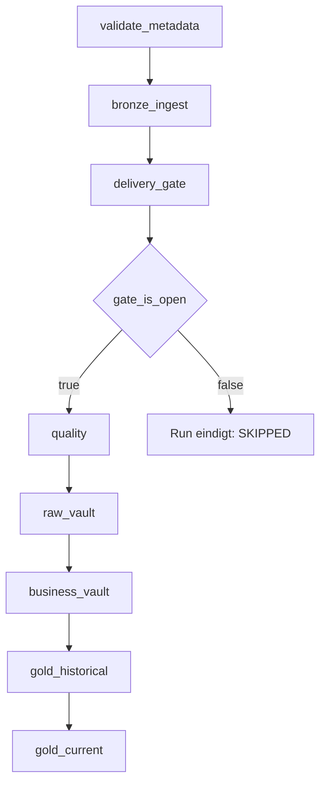
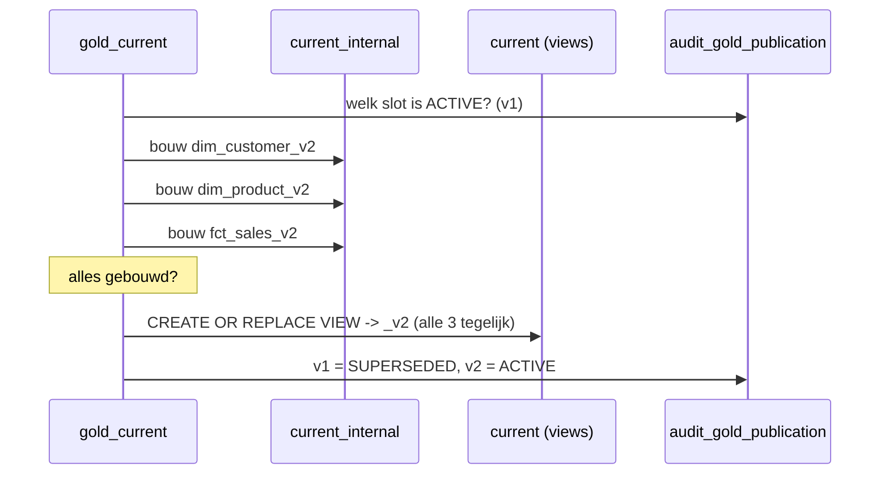

# Workflow design

## Uitgangspunt

De Workflow-graaf bevat **geen inhoudelijke afhankelijkheden**. De taken vormen
alleen de lagen. Welke entiteiten binnen een laag draaien en in welke volgorde,
komt uit `meta_dependency`. Een nieuw bronobject of een nieuwe satellite vereist
dus geen wijziging in [workflows/pipeline.job.yml](../workflows/pipeline.job.yml).

## Taakgraaf



| Taak | Notebook | Verantwoordelijkheid |
|---|---|---|
| `validate_metadata` | 99 | Cycli, wees-verwijzingen en compileerbaarheid van alle expressies |
| `bronze_ingest` | 10 | Auto Loader per bronobject; `max_retries: 3` wegens schema evolution |
| `delivery_gate` | 05 | Bepaalt de eerstvolgende complete levering; zet `gate_open` en `delivery_id` als taskValue |
| `gate_is_open` | — | `condition_task`; blokkeert alles wat volgt als de levering niet compleet is |
| `quality` | 20 | DQ-regels in één pass; passed → Quality, failed → Reject |
| `raw_vault` | 30 (`zone=RAW_VAULT`) | Hubs, links, satellites in topologische volgorde |
| `business_vault` | 30 (`zone=BUSINESS_VAULT`) | Computed satellites |
| `gold_historical` | 40 | SCD2 MERGE |
| `gold_current` | 41 | Bouwt slots en publiceert de publication group in één stap |

## Trigger

```yaml
trigger:
  file_arrival:
    url: /Volumes/raw_<env>/sales/landing
    min_time_between_triggers_seconds: 300
    wait_after_last_change_seconds: 120
```

Auto Loader start Bronze zodra er bestanden binnenkomen. `wait_after_last_change`
voorkomt dat de run start terwijl het bronsysteem nog bezig is met uploaden.

## De gate

De gate is geen hardcoded `depends_on` maar een metadata-uitspraak:

```sql
SELECT is_ready FROM contoso_meta_<env>.audit.v_delivery_readiness
WHERE delivery_id = 'SALES|2026-08-30';
```

`is_ready` is waar als alle objecten met
`meta_source_object.is_mandatory_in_delivery = true` voor die `delivery_id` de
status `SUCCESS` hebben en er geen `FAILED` is.

Daarnaast levert `v_next_processable_delivery` per bronsysteem de laagste nog niet
verwerkte levering. Zo worden leveringen chronologisch ingehaald na een storing;
levering N+1 start niet voordat N is afgerond.

## Batch-consistentie

`delivery_gate` genereert één `batch_id` en geeft die als taskValue door aan alle
volgende taken. Alle stappen delen daardoor dezelfde `batch_id` en dezelfde
`load_date` — een harde eis voor correcte Data Vault historisatie.

## Gold Actueel publicatie



Faalt een van de builds, dan worden de publicaties op `FAILED` gezet, blijven de
views naar `_v1` wijzen en blijft de vorige — onderling consistente — versie
actief.

## Jobs

| Job | Trigger | Doel |
|---|---|---|
| `setup_lakehouse` | Handmatig / bij deploy | DDL uitvoeren, metadata seeden, model valideren |
| `contoso_lakehouse_pipeline` | File arrival | End-to-end verwerking van een levering |
| `lakehouse_maintenance` | Zondag 03:00 | `OPTIMIZE`, `VACUUM`, opruimen van verlopen Gold-slots |

## Schalen naar tientallen bronsystemen

De pipeline is geparametriseerd op `source_system_id`. Voor een tweede bronsysteem
volstaat een extra target in de bundle met een eigen `file_arrival`-trigger en
eigen metadata; de notebooks en het framework blijven ongewijzigd.

Bij groei richting duizenden tabellen zijn de openstaande punten uit
[00_besluitenlog.md](00_besluitenlog.md#6-openstaande-punten) relevant, met name
stream-groepering per bronsysteem in plaats van per tabel.
