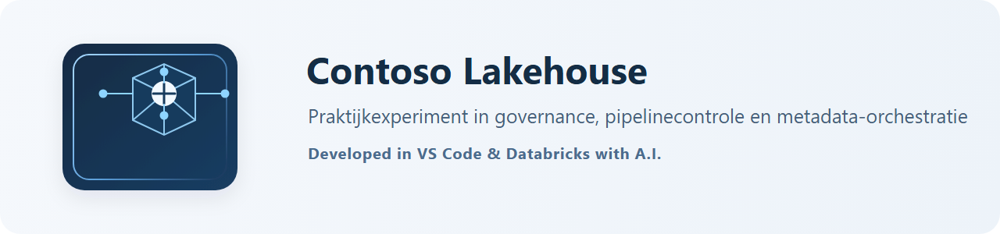

**Versie:** 2.0  
**Datum:** 6 september 2026  
**Status:** afgerond prototype, gevalideerd in `dev`  
**Technologie:** Azure Databricks, Unity Catalog, Delta Lake, Databricks Workflows en Microsoft Fabric SQL Database als bron

> **AI-verantwoording:** dit document en het onderliggende praktijkexperiment zijn tot stand gekomen in nauwe samenwerking tussen mens en AI (GitHub Copilot). AI is ingezet voor ontwerp, implementatie, tests en documentatie; sturing, besluitvorming, review en validatie van de resultaten kwamen van de mens. Deze samenwerking heeft de kwaliteit en snelheid van het experiment versterkt.

## 1. Managementsamenvatting

Dit praktijkexperiment realiseert een **werkend, aantoonbaar gevalideerd metadata-gedreven Lakehouse-prototype met enterprise-geïnspireerde ontwerpprincipes**. Het prototype verwerkt bestandsleveringen en externe pull-bronnen via Landing Volume, Bronze, Quality/Reject, Data Vault of Reference Data, historisch Gold en actueel Gold.

De runtime en governance-laag zijn Azure Databricks, Unity Catalog en Delta Lake. Microsoft Fabric is aangesloten als werkende SQL-bron: een Fabric SQL Database wordt met JDBC uitgelezen, schrijft een immutable Parquet-levering naar het Databricks Landing Volume en wordt vervolgens door dezelfde metadata-gedreven keten verwerkt. Dit is dus geen native Fabric Lakehouse-implementatie.

De Azure-inrichting die nodig is voor deze werking is vastgelegd in
[08_azure_inrichting.md](08_azure_inrichting.md). Daarin staan de actuele
workspace-, storage-, Access Connector-, Event Grid-, SQL Warehouse-,
identity- en Unity Catalog-specificaties, inclusief de nog te bevestigen
Azure Resource Manager-eigenschappen voor productie.

De kernketen en de belangrijkste foutscenario's zijn in `dev` bewezen. De Fabric Sales-delivery `FABRIC_SALES|2026-09-06` doorliep succesvol Bronze, delivery-gate, Quality, Reference Data, Gold Historisch en Gold Actueel. Een onafhankelijke read-only controle telde 542 rijen in elk van deze lagen. De lokale regressiesuite eindigde met **131 geslaagde tests**.

De oplossing is geschikt als gevalideerd architectuurprototype en als basis voor een gecontroleerde testomgeving. Productieacceptatie vereist nog bewijzen voor volume, recovery, beveiliging, governance, kosten en operationeel beheer.

## 2. Aanleiding en doelstelling

De opdracht was een metadata-gedreven Lakehouse-oplossing te ontwerpen met de lagen Volume, Brons, Quality, Data Vault, Historische Datamart en Actuele Datamart. Orders, Customers en Products vormen samen een levering. Vervolgverwerking mag pas starten wanneer alle verplichte objecten voor dezelfde ontvangstdatum succesvol zijn geladen.

Het doel was een herbruikbaar framework, niet een eenmalige Sales-pipeline: nieuwe bronobjecten moeten zo veel mogelijk met metadata worden toegevoegd, zonder nieuwe notebooks of workflowlogica te bouwen.

```text
Bronbestand, API of Fabric SQL
  -> immutable Landing Volume
  -> Bronze
  -> metadata-gestuurde delivery-gate
  -> Quality / Reject
  -> Raw Vault of Reference Data
  -> Business Vault
  -> Gold Historisch
  -> Gold Actueel
```

## 3. Scope en afbakening

### Binnen scope

- Metadata voor systemen, objecten, connectors, mappings, afhankelijkheden, kwaliteitsregels, Data Vault en Gold.
- Landing via Unity Catalog Volumes en incrementele Bronze-ingest via Auto Loader, checkpoints en Delta Lake.
- Quality-controles, traceerbare rejects en auditeerbare deliveries en runs.
- Data Vault 2.0-principes voor historiserende Sales- en CBS-data.
- De expliciete `REFERENCE_DATA`-route voor ECB, Nager en Fabric Sales.
- Historische en actuele Gold-datamarts met atomische publicatie.
- Pull-extracten voor CBS, ECB, Nager en Fabric SQL; file-arrival voor Sales.

### Buiten scope

- Native Fabric Lakehouse-, Fabric Data Factory- of Fabric Notebook-runtime.
- Formele productie-SLA's, RPO/RTO-bewijs, 24x7-on-call en volledige FinOps.
- Business-mastering en semantische multi-source integratie.
- Een generieke CDC-implementatie voor alle connectoren.

## 4. Requirements en realisatie

| Requirement | Realisatie | Bewijsstatus |
|---|---|---|
| Leveringen per bron en datumfolder | Bron-specifieke immutable Landing Volumes | Gevalideerd in dev |
| Incrementeler Bronze-load | Auto Loader met checkpoints en metadata per object | Gevalideerd in dev |
| Nieuwe bronkolommen accepteren | `RESCUE`, `addNewColumns` en Delta `MERGE WITH SCHEMA EVOLUTION` | Gevalideerd met Fabric Sales |
| Onvolledige levering blokkeren | Delivery-gate op verplichte objecten en chronologische selectie | Gevalideerd in dev |
| Metadata-gedreven besturing | Objecten, mappings, DQ, routes, DV en Gold in Git-beheerde seedmetadata | Gevalideerd |
| Rejects opslaan | Payload, alle faalredenen en herstelstatus in `rj_*` | DDL en gedrag gevalideerd |
| Historiseren | Raw Vault, Business Vault en SCD2 Gold Historisch | Gevalideerd in dev |
| Actuele datamart | Current views op v1/v2-slots met groepsreleasepointer | Gevalideerd in dev |
| Oude versie behouden bij fout | Pointer wijzigt pas na volledige succesvolle build | Ontwerp en foutscenario gevalideerd |
| Herleidbaarheid | Audit-events, delivery, batch, bronbestand en metadata-versie | Gevalideerd in dev |

## 5. Architectuur

| Laag | Verantwoordelijkheid |
|---|---|
| Landing Volume | Ongewijzigde, immutable bronbestanden per datum |
| Bronze | Alle bronkolommen plus technische lineage, zonder businessfilter |
| Quality | Typen, contracteren en valideren volgens metadata |
| Reject | Ongeldige records met originele payload en alle faalredenen |
| Raw Vault | Hubs, links en historiserende satellites zonder interpretatie |
| Business Vault | Computed satellites, PIT en versioned referentiedata |
| Gold Historisch | Historisch dimensioneel contract met SCD2-informatie |
| Gold Actueel | Laatste volledig succesvolle release per publicatiegroep |
| Metadata/Audit | Besturing, versiebeheer, status, kwaliteit en monitoring |

### Metadata als besturingslaag

De bestanden in `metadata/seed` zijn de versieerbare bron van waarheid. De setup-job synchroniseert deze idempotent naar Unity Catalog. Het model bevat systemen, objecten, connectors, mappings, kwaliteitsregels, afhankelijkheden, Data Vault-entiteiten, Gold-entiteiten en auditmetadata.

Elke metadatarelease krijgt een deterministische SHA-256-fingerprint. Audit-runs bewaren die versie, zodat incidentonderzoek en herverwerking aan de exacte Git/DAB-configuratie kunnen worden gekoppeld.

### Orchestratie en delivery-gate

De workflow bevat alleen technische lagen; inhoudelijke entiteitsafhankelijkheden staan in metadata en worden topologisch geordend.

```text
validate_metadata
  -> plan_bronze_fanout
  -> bronze_ingest
  -> delivery_gate
  -> quality
  -> raw_vault en/of reference_data
  -> business_vault
  -> gold_historical
  -> gold_current
```

Bronze gebruikt een begrensde Databricks `for_each_task` per bronobject. De gate opent alleen voor een complete levering met succesvolle verplichte objecten. Een latere levering wacht op de oudste nog niet afgehandelde levering van hetzelfde bronsysteem. Dit beschermt de tijdsvolgorde van snapshot- en SCD2-verwerking.

De end-to-end pipeline kan standaard drie gelijktijdige runs uitvoeren. Deze
paralleliteit is bedoeld voor onafhankelijke bronsystemen. De delivery-gate
handhaaft de chronologische seriele verwerking binnen ieder bronsysteem; voor
een hoger volume moeten runtimes, Delta-concurrency en kosten eerst worden
gemeten.

### Data Vault en Gold

De Raw Vault gebruikt SHA-256, centrale normalisatie, een null-token en separator. Multi-source hubs gebruiken een collision code. Satellites zijn fysiek insert-only; `load_end_date` en `is_current` worden via views afgeleid. Zo wordt historisch Delta-data niet bij iedere load herschreven.

Gold Actueel gebruikt per publicatiegroep twee fysieke slots (`_v1` en `_v2`). Publieke views volgen een enkele releasepointer. Bij een mislukte build blijft die pointer ongewijzigd en zien BI-consumenten de vorige consistente release.

### Brontypen

| Bronsysteem | Aanleverpatroon | Status |
|---|---|---|
| `SALES` | Push: ERP-export naar Landing | Actief |
| `CBS` | Pull: OData naar Landing | Actief |
| `ECB` | Pull: HTTP/CSV naar Landing | Actief |
| `NAGER` | Pull: HTTP/JSON naar Landing | Actief |
| `FABRIC_SALES` | Pull: JDBC uit Fabric SQL naar Landing | Actief en gevalideerd |
| `SHAREPOINT` | Voorbereid in metadata | Inactief |

Wanneer een immutable delivery al in Landing staat, kan de generieke pipeline direct vanaf Bronze worden gestart. Dit is het gecontroleerde herstelpad na een fout in Quality, Vault of Gold, zonder de bron opnieuw te belasten.

## 6. Belangrijkste ontwerpkeuzes

1. **Landing is immutable.** Extracties schrijven eerst naar staging en publiceren pas na succesvolle voltooiing naar de datumfolder.
2. **Bronze bewaart de bron.** Bij `RESCUE` blijven onbekende velden fysiek in Bronze via schema evolution; Quality bepaalt het expliciete businesscontract.
3. **Metadata is privileged code.** Metadata is Git-beheerd, identifiers worden gevalideerd en eindgebruikers krijgen in productie geen schrijfrechten.
4. **Quality werkt in een gecombineerde pass.** Dit voorkomt N tabelscans voor N kwaliteitsregels.
5. **Audit is append-only.** Parallelle Serverless-taken schrijven events; statusviews leiden daaruit de actuele status af.
6. **Routes zijn expliciet.** `RAW_VAULT` en `REFERENCE_DATA` voorkomen dat referentiebronnen onnodig als hubs, links en satellites worden gemodelleerd.
7. **Gold Actueel is een groepscontract.** De publicatiegroep voorkomt nieuwe dimensies naast oude feiten.

## 7. Validatie en herstelbevindingen

### Lokale en deploymentvalidatie

De regressiesuite controleert onder meer hashconventies, veilige identifiers, placeholderresolutie, DQ-drempels, afhankelijkheidsgrafen, schema-drift, Gold-publicatie, connectoren en DDL-dekking.

```text
py -m pytest -q
131 passed
```

Daarnaast is lokaal geborgd dat de zelfstandige CBS-, ECB- en Fabric Sales-laadjobs
eerst hun pull-/extracttaak uitvoeren en pas daarna de generieke pipeline starten.
De pull-laadjobs zijn bovendien voorzien van Databricks schedules: in `dev`
standaard gepauzeerd en in `tst`/`prd` activeerbaar via de bundle-variabele
`pull_schedule_pause_status`.

De Databricks Asset Bundle is gevalideerd en naar `dev` gedeployed. De idempotente setup-job is na relevante DDL- en metadatawijzigingen succesvol uitgevoerd.

Op 6 september 2026 is de stressleveringsgenerator aangescherpt na een instabiele run. De write-stap valideerde eerder exact het aantal part-files per object en kon daardoor falen bij adaptive Spark-planning. De generator accepteert nu elk positief aantal geschreven part-files, verwijdert vooraf eventuele stagingresten en geeft expliciete feedback over het daadwerkelijk geschreven aantal bestanden per object. Daarnaast geeft het notebook nu een duidelijkere melding bij hergebruik van een bestaande `delivery_date`.

De hervatting van Fase 2 van de Sales-stresstest is op 6 september 2026 operationeel geblokkeerd. Een lokale `databricks bundle validate --target dev` bereikte de dev-workspace, maar eindigde met HTTP 403 `Invalid access token`; er is daardoor geen job of datawijziging gestart. Vernieuw eerst de lokaal geconfigureerde Databricks-authenticatie en valideer de bundle opnieuw. Start daarna de pipeline voor `SALES`: de chronologische gate moet eerst `SALES|2026-09-10` verwerken en pas vervolgens `SALES|2026-09-11` met `change_set=1`. Controleer na beide succesvolle runs de SCD2-versies, deletes, hashdiffs en de actieve `SALES_MART`-publicatiegroep.

Na vernieuwde CLI-authenticatie valideerde de Asset Bundle op 6 september 2026 succesvol voor `dev`. Pipelinerun `775524928887640` startte voor `SALES` en eindigde technisch succesvol na 244 seconden. Metadata-validatie en alle vijf Bronze-objecttaken slaagden; de delivery-gate gaf `SKIPPED` terug en zette de conditionele vervolgroute correct uit. Daardoor startten Quality, Vault en Gold niet. De gate retourneert uitsluitend `SKIPPED` wanneer `v_next_processable_delivery` geen complete, nog niet verwerkte Sales-delivery bevat. De eerder genoemde folders `2026-09-10` en `2026-09-11` zijn in deze runtime dus niet beschikbaar als verwerkbare wachtrij of voldoen niet aan het actuele metadata-contract; vervolgonderzoek vereist read-only inspectie van `audit_delivery`, `audit_delivery_object` en de Gold-publicatiegroep.

### Bewezen scenario's

- Valide Sales-deliveries doorlopen de volledige Raw Vault- en Gold-keten.
- Een ongeldige delivery wordt bij Quality geblokkeerd; Vault en Gold starten dan niet.
- De chronologische gate verwerkt geen nieuwere delivery zolang een oudere nog geblokkeerd is.
- CBS, ECB en Nager zijn als brongebonden data-producten ingericht.
- ECB filtert expliciet niet-castbare SDMX-observaties, maar blokkeert nul- en negatieve wisselkoersen nog steeds hard.
- Gold-entiteiten zijn aan `source_system_id` gebonden. Een niet-Sales-delivery kan daardoor geen `SALES_MART` publiceren.
- `FABRIC_SALES|2026-09-06` is volledig verwerkt met 542 rijen in Bronze, Quality, Reference Data, historisch Gold en actueel Gold.

### Fabric Sales: feitelijke herstelcyclus

De eerste Fabric Sales-run faalde terecht in Bronze: de live metadata voor onbekende velden was niet met de Git-seed gesynchroniseerd en vereiste mapping-goedkeuring. Na deploy en setup stond de runtime weer op `RESCUE`.

De volgende run bereikte Quality en toonde dat `total_due_amount` voor alle 542 regels `NULL` was. Read-only onderzoek bevestigde dat `subtotal_amount`, `tax_amount` en `freight_amount` gevuld waren. De Quality-mapping leidt daarom het totaal deterministisch af als:

$$
\text{total\_due\_amount} = \text{subtotal\_amount} + \text{tax\_amount} + \text{freight\_amount}
$$

De harde DQ-controle voor ontbrekende of negatieve totalen blijft actief. Een daaropvolgende run vond de ontbrekende rejecttabel `contoso_reject_dev.fabric_sales.rj_order_lines`; deze is idempotent aan de DDL en het steward-overzicht toegevoegd. Na deploy en setup was de volgende run volledig succesvol.

Deze cyclus toont gecontroleerd herstel: brondata is niet aangepast; alle correcties waren metadata- of DDL-gedreven, lokaal getest, gedeployed en in de runtime opnieuw bewezen.

## 8. Enterprise-beoordeling

### Sterke punten

- Nieuwe objecten zijn grotendeels configureerbaar zonder pipelinecode.
- Bronsystemen en Gold-publicaties zijn bewust gescheiden.
- Immutable Landing, delivery-gate en chronologie beperken gedeeltelijke en out-of-order historisatie.
- Metadata-validatie, DQ en traceerbare rejects maken beheer op grotere schaal realistisch.
- De atomische Gold-pointer beschermt consumenten tegen inconsistente marts.

### Grenzen en resterende risico's

- Task values voor fan-out hebben een limiet. Bij veel objecten is een Delta control-tabel als plannerinput nodig.
- `SNAPSHOT_SCD2` voor Reference Data mist nog een formeel snapshot-compleetheidscontract en expire-logica voor verdwenen sleutels.
- Multi-source integratie vereist een aparte Business Vault-run met matching, mastering, freshness- en versiecontracten.
- Nieuwe Bronze-kolommen zijn technisch veilig op te slaan, maar vragen nog een formeel governanceproces voor classificatie, mapping en Gold-publicatie.
- De uitgevoerde tests bewijzen gedrag, niet productiecapaciteit, kostenplafond of herstelbaarheid binnen een afgesproken RPO/RTO.

## 9. Productie-readiness

| Domein | Status | Benodigde vervolgstap |
|---|---|---|
| Functionele kernketen | Groen | Behouden als acceptatiebaseline |
| Metadata en orkestratie | Groen/amber | Schaaltest en plannerfallback toevoegen |
| Schema evolution | Groen/amber | Governance- en approvalproces operationaliseren |
| Data Vault | Amber | Effectivity- en delete-scenario's aantonen |
| Gold Actueel | Groen/amber | Foutinjectie over alle views herhalen |
| Security en privacy | Amber | Least-privilege, PII-classificatie en secretscan formaliseren |
| Operations en recovery | Amber/rood | Runbooks, replay en RPO/RTO testen |
| Performance en kosten | Amber | Volume-, DBU- en storagebenchmark uitvoeren |

### Ontwikkelde applicatie: Contoso Control Room

Naast de data-engineeringketen is een operationele webapplicatie ontwikkeld:
**Contoso Control Room**. Deze Streamlit-applicatie is beschikbaar als
Databricks App en biedt een read-only overzicht van deliveries, runs, Gold-
publicaties, kwaliteits- en operationele breaches en openstaande work-items.

De app ondersteunt daarnaast gecontroleerde operatoracties, zoals het opnieuw
inplannen van dead-letter work-items, het vrijgeven van een quarantained
delivery en het uitvoeren van onderhoud. Deze acties schrijven niet rechtstreeks
naar audit-tabellen, maar starten de bestaande Databricks-remediation- en
maintenance-jobs. Reden, uitvoerder en approval/change-referentie zijn daarbij
verplicht.

**Open de applicatie:** [Contoso Control Room](https://contoso-control-room-7405619535862062.2.azure.databricksapps.com/)

**Open de workspace:** [Databricks](https://adb-7405619535862062.2.azuredatabricks.net/?o=7405619535862062)

De broncode staat in [app/streamlit_app.py](../app/streamlit_app.py) en de
lokale/deploymentinstructies staan in [app/README.md](../app/README.md).

Het advies is: **nog niet vrijgeven voor productie**, maar het resultaat wel accepteren als werkend en aantoonbaar gevalideerd prototype. Een volgende fase moet gericht zijn op het bewijzen en operationaliseren van niet-functionele productiekwaliteit, niet op ontbrekende basisfunctionaliteit.

## 10. Conclusie

De doelstelling is gerealiseerd. Er staat een metadata-gedreven Lakehouse-prototype waarin bronnen via Landing gecontroleerd worden verwerkt, datakwaliteit en afwijzingen traceerbaar zijn, historisatie via Data Vault of versioned Reference Data plaatsvindt en Gold Actueel uitsluitend na een volledige succesvolle run atomisch wordt gepubliceerd.

De uitvoering toont bovendien dat het ontwerp onder realistische fouten beheersbaar blijft. Schema-drift, een onvolledig bedragcontract en een ontbrekende rejectvoorziening zijn onderzocht, structureel hersteld en opnieuw gevalideerd. Daarmee is dit meer dan een architectuurtekening: een **werkend, aantoonbaar gevalideerd metadata-gedreven Lakehouse-prototype met enterprise-geïnspireerde ontwerpprincipes**.

Voor technische verdieping wordt verwezen naar [architectuur](01_architecture.md), [workflowontwerp](05_workflow_design.md) en de [besluitenlog](00_besluitenlog.md).

## 11. Architectuurreview 6 september 2026

Op verzoek is een kritische review uitgevoerd vanuit het perspectief Principal Data Architect (Databricks, Delta Lake, Data Vault 2.0, Fabric). Kernbevindingen:

- **Schaalbaarheid**: delivery-gate en chronologische catch-up serialiseren te sterk voor honderden objecten; Gold-MERGE doet full-scans zonder incrementeel venster.
- **Beheer**: metadata mist versie-/approvalproces (policy `ALLOW_NEW_COLUMNS_WITH_APPROVAL` heeft geen approval-mechanisme), retry-configuratie is gedenormaliseerd, cycle-detectie op de afhankelijkheidsgraaf ontbreekt.
- **Performance**: Auto Loader-checkpoints liggen in de raw Volume (retentierisico); `mergeSchema`-reader-optie is overbodig; liquid clustering verkiezen boven ZORDER op hash-keys.
- **Afhankelijkheden**: `SAME_DELIVERY` is gedefinieerd maar nergens toegepast; out-of-order leveringen (late levering die in het verleden moet invoegen) zijn ongedefinieerd.
- **Metadata-tekortkomingen**: delete-semantiek (hard/soft/absence), late-arrival-window, freshness-SLA, schema-contractversie en backfill-strategie ontbreken.
- **Laadstrategieën**: `INCREMENTAL_CDC` en `PARTIAL_SNAPSHOT` zijn enterprise-kritisch en moeten vóór verdere brononboarding worden geïmplementeerd; scope van `SNAPSHOT_SCD2` (welke laag, absence-detectie) moet expliciet.
- **Schema evolution**: alleen additief gedekt; rename/drop en remediatie vanuit `_rescued_data` ontbreken; bij schaal is een voorgestelde-metadata-diff-generator nodig.
- **Gold Actueel**: slotwisseling is per entiteit (inconsistentievenster binnen een publication group); soft deletes verdwijnen stilletjes uit de actuele mart; rollback beperkt tot één versie.
- **Fabric**: hybride landschap vereist expliciete keuzes rond OneLake-shortcuts, tweede security-perimeter en eigenaarschap van de actuele mart.

Besluit: fundament (metadata-gedrevenheid, gate, rejects, atomische publicatie) biedt een solide basis richting enterprise-niveau, met nog openstaande risico's; prioriteit ligt bij delete-/rename-semantiek, CDC + PARTIAL_SNAPSHOT, metadata-CI/CD en tiering van de gate.

## 12. Verwerking review — 6 september 2026

Eerste, laag-risico reeks verbeteringen is doorgevoerd:

- **`meta_source_object.json`**: alle elf bronobjecten hebben nu `delete_semantics`, `absence_means_delete`, `schema_contract_version`, `late_arrival_window_days`, `freshness_sla_hours` en `backfill_strategy`. Delete-semantiek is alleen `SOFT_DELETE_FLAG` waar een `is_deleted`-vlag bestaat; `absence_means_delete` alleen `true` bij volledige gecureerde snapshots (SALES-dimensies, SharePoint, Fabric), niet bij append-only of referentiefeeds (CBS, ECB, Nager). Checkpoints van de SALES-objecten zijn verplaatst van `raw_${env}` naar `control_${env}` om het retentierisico op de landingzone te dichten.
- **`meta_dependency.json`**: de vier kern-links (`LNK_ORDER_CUSTOMER`, `LNK_ORDER_PRODUCT`) gebruiken nu `SAME_DELIVERY` in plaats van `UPSTREAM_SUCCESS`, zodat hubs uit dezelfde levering worden gecombineerd.
- **`10_metadata_model.sql`**: twee nieuwe tabellen toegevoegd — `meta_retry_policy` (referentie voor retry/prioriteit, tegen duplicatie in `meta_dependency`) en `meta_schema_drift_approval` (formele PENDING/APPROVED/REJECTED-workflow, waarmee de bestaande policy `ALLOW_NEW_COLUMNS_WITH_APPROVAL` afdwingbaar wordt).
- **`02_metadata_model.md`**: nieuwe velden en tabellen gedocumenteerd.

Nog openstaand (bewust niet in deze ronde): implementatie van `INCREMENTAL_CDC` en `PARTIAL_SNAPSHOT`, incrementeel venster in Gold-MERGE, gate-tiering op `criticality`, en cycle-detectie op de afhankelijkheidsgraaf.

## 13. Verwerking resterende reviewpunten — 6 september 2026 (tweede ronde)

De vier bewust uitgestelde punten zijn nu alsnog doorgevoerd en getest; de volledige regressiesuite staat inmiddels op 131/131 groen:

- **Laadstrategieën `INCREMENTAL_CDC` en `PARTIAL_SNAPSHOT`** geïmplementeerd in [bronze.py](../src/contoso_lakehouse/bronze.py). CDC voegt `_cdc_op` toe aan de MERGE-match zodat I/U/D apart landt; SCD2-resolutie blijft downstream. PARTIAL_SNAPSHOT deelt het APPEND-pad maar respecteert `absence_means_delete=false`, zodat een deelsnapshot nooit als delete wordt geïnterpreteerd. De test die beweerde dat CDC onbekend was, is omgebouwd tot een test die het correcte MERGE-gedrag bewijst.
- **Incrementeel venster in Gold-MERGE** in [gold.py](../src/contoso_lakehouse/gold.py): `load_historical` accepteert nu `incremental_since`; bij SCD2-entiteiten filtert de subquery op `load_date >= incremental_since`, waardoor de full-scan-per-run verdwijnt. Zonder waarde valt de loader veilig terug op de volledige set (backfill).
- **Gate-tiering op `criticality`** in [orchestration.py](../src/contoso_lakehouse/orchestration.py): naast `require_delivery_complete` is er `require_delivery_critical_complete`, die alleen HIGH-criticaliteitsobjecten afdwingt. Eén traag MEDIUM/LOW-object blokkeert de keten niet meer.
- **Governancevelden in het dataclass-model** in [metadata.py](../src/contoso_lakehouse/metadata.py): `SourceObject` draagt nu `delete_semantics`, `absence_means_delete`, `schema_contract_version`, `late_arrival_window_days`, `freshness_sla_hours` en `backfill_strategy`, zodat de loaders de seed-waarden daadwerkelijk kunnen gebruiken.

Correctie op paragraaf 11: Gold Actueel publiceert al atomisch per publicatiegroep via één gedeelde releasepointer (`publish_group`), waardoor het eerdergenoemde inconsistentievenster binnen een groep niet bestaat.

## 14. Liquid clustering metadata-gedreven gemaakt — 6 september 2026

- De Gold-DDL gebruikte al `CLUSTER BY`, maar de metadata heette nog `zorder_columns` en was niet leidend. Dat is nu rechtgetrokken.
- [meta_gold_entity.json](../metadata/seed/meta_gold_entity.json): alle 23 Gold-entiteiten gebruiken `cluster_columns`; `zorder_columns` is volledig verdwenen. Feiten behouden `partition_columns` op datum; dimensies gebruiken uitsluitend clustering op hun hash-key.
- [metadata.py](../src/contoso_lakehouse/metadata.py): `GoldEntity` draagt nu `partition_columns` en `cluster_columns`, zodat de setup-notebook de DDL metadata-gedreven kan genereren.
- Bestaande tabellen vereisen een eenmalige `ALTER TABLE ... CLUSTER BY` of rebuild; liquid clustering werkt incrementeel en vereist daarna minder `OPTIMIZE`-onderhoud dan ZORDER.

## 15. Verwerking architectuurreview — 6 september 2026 (derde ronde)

De resterende aantoonbare reviewrisico's zijn in de runtime en metadata-CI verwerkt:

- **Gold Actueel is gefenced per publicatiegroep.** `audit_gold_publication_lease` claimt de groep exclusief gedurende build en publicatie. De lease verloopt na vier uur en iedere zichtbaarheid-mutatie controleert het lease-id en de vervaltijd, zodat een vertraagde of geannuleerde job geen nieuwere release kan overschrijven. De nieuwe publicaties krijgen eerst status `ACTIVE`, daarna wisselt de groepspointer en pas daarna worden oude publicaties gemarkeerd als `SUPERSEDED`. Consumenten houden daardoor de vorige volledige release totdat een volledige nieuwe release klaarstaat.
- **Schema-driftapproval is uitvoerbaar.** `ALLOW_NEW_COLUMNS_WITH_APPROVAL` leest alleen goedgekeurde `ADD_COLUMN`-records uit `meta_schema_drift_approval`; niet-goedgekeurde kolommen blokkeren Bronze. `RESCUE` blijft de expliciete policy voor technisch accepteren zonder business-publicatie.
- **Metadata-guardrails zijn releaseblokkering.** De validator weigert ongeldige laadstrategieën, inconsequente delete-semantiek en ongeldige dependency-types. `absence_means_delete` is uitsluitend toegestaan voor `SNAPSHOT_SCD2`, zodat een deelsnapshot nooit stilzwijgend een delete veroorzaakt.
- **Afhankelijkheden zijn runtime-semantiek.** Quality bepaalt de volgorde via topologische waves uit `meta_dependency`; `SAME_DELIVERY` controleert naast `batch_id` expliciet de delivery-id.

Correctie op de review: de historische Gold-load is reeds SCD2-conform voor de bestaande entiteiten. De Gold-seeds nemen `valid_from` of `version_valid_from` op in de samengestelde business key en projecteren de historiserende, insert-only Satellite-views. Een generieke afsluit-MERGE in Gold zou dit contract dubbel toepassen en is daarom bewust niet toegevoegd.

De nog noodzakelijke productieactiviteit is een schaal- en hersteltest met gelijktijdige jobs, lease-conflict, foutinjectie tussen Gold-statustransities en realistische Delta-concurrentie. De lokale regressiesuite dekt contracten en SQL-generatie, geen runtime-capaciteit of RPO/RTO.

## 16. Delivery-manifest als gatecontract — 6 september 2026

`audit_delivery_manifest` is toegevoegd als centrale verklaring dat een
delivery volledig is gepubliceerd. Het contract bewaart de bron, het fysieke
manifestpad, verwachte en ontvangen bestandsaantallen, objectaantal, optionele
watermark en de volledigheidsverklaring voor snapshots.

De chronologische delivery-gate accepteert nu alleen een `CLOSED` manifest met
consistente aantallen. Bronnen waarvoor `absence_means_delete = true` vereisen
daarnaast `is_snapshot_complete = true`; een deelsnapshot kan daardoor geen
stille deletes veroorzaken. De bestaande API- en Fabric SQL-extractors sluiten
het manifest uitsluitend na de atomische verplaatsing van staging naar Landing.
De demo- en stressgeneratoren volgen hetzelfde patroon.

Een pushend bronsysteem moet de rootfile `_manifest.json` als laatste schrijven,
nadat alle objectbestanden voor de delivery aanwezig zijn. De volgende
praktische productievalidatie is een run met een bewust ontbrekend bestand en
een onvolledig manifest: de gate moet gesloten blijven en een latere delivery
mag de chronologische wachtrij niet passeren.

## 17. Generieke push-manifestregistratie — 6 september 2026

De pipeline voert nu vóór de Bronze fan-out notebook 04 uit. Deze taak scant
uitsluitend datumfolders van het geselecteerde bronsysteem en leest alleen
rootmanifests met `status = CLOSED`. De `delivery_id` moet overeenkomen met
bronsysteem en folderdatum; `file_count` moet ten minste het verplichte
objectaantal dekken. Voor bronnen met snapshot-deletes is expliciet
`is_snapshot_complete = true` vereist.

Pull-extractors blijven het auditmanifest direct sluiten zodra zij hun staging
folder atomisch publiceren. Push-bronnen schrijven daarentegen alleen het
fysieke rootmanifest; de nieuwe generieke taak registreert dit vervolgens
idempotent in audit. Daarmee is er voor beide aanleverpatronen een gelijk
delivery-gatecontract zonder bronspecifieke orkestratie.

## 18. Control plane: state machine en work-items — 6 september 2026

Delivery-statussen worden niet langer uitsluitend in losse notebooks gewijzigd.
`AuditLogger.transition_delivery` valideert toegestane overgangen en schrijft
iedere actie append-only weg in `audit_delivery_state_transition`. Een
quarantaine-vrijgave of supersede-actie vereist een reden en een
approval-reference; de bestaande remediation-notebooks gebruiken dit contract.

Voor iedere deliverygebonden Quality-, Vault- en Gold-run plant en claimt
`AuditLogger.run` een work-item in `audit_work_item`. De queue bevat pogingnummer,
maximale pogingen, een lease van vier uur, foutinformatie, vertraagde retry en
`DEAD_LETTER` na uitputting van het retrybudget. Dit vormt de operationele
backend voor een toekomstige planner en read-only operations-app. Bronze blijft
bewust buiten deze automatische koppeling, omdat een Auto Loader-microbatch
meerdere deliveries kan bevatten.

## 19. Policy-driven Delta-onderhoud — 6 september 2026

De eerdere brede maintenance-loop met een globale VACUUM-retentie is vervangen
door `meta_table_maintenance_policy`. De Git-beheerde basispolicies scheiden
Bronze, Quality, Reject, Vault, Gold en auditmetadata op onderhoudstier,
interval, minimumaantal files en retentie. Auditmetadata staat standaard op
`DISABLED` voor OPTIMIZE en behoudt een langere retentie.

Notebook 90 maakt altijd een auditrecord voor de onderhoudsrun en schrijft per
tabel een actie met `PLANNED`, `SKIPPED`, `EXECUTED` of `FAILED`. In `dry_run`
worden alleen plannen geregistreerd. Een productie-run voert uitsluitend
`OPTIMIZE` en `VACUUM` uit wanneer een actieve policy bestaat, de filedrempel is
bereikt en geen succesvolle optimalisatie binnen het policy-interval bestaat.

## 20. Metadata release-gate — 6 september 2026

De dependency-vrije command `python -m contoso_lakehouse.release_check`
valideert de volledige Git-seed vóór deployment. De gate controleert JSON,
primaire sleutels, dependency-verwijzingen en minimale VACUUM-retentie. Hij
genereert tevens de deterministische SHA-256-fingerprint van precies de release
die later door de setup-job wordt geregistreerd.

De release-check is bedoeld als eerste CI-gate. `pytest -q` levert de
regressiedekking en notebook 99 blijft de tweede, Databricks-runtimegerichte
gate voor `EXPLAIN`, metadataexpressies en Unity Catalog-objecten.

## 21. Operationele SLO-monitoring — 6 september 2026

Notebook 43 en een zelfstandige, halfuurlijkse Databricks Workflow bewaken de
control plane. De job faalt bewust bij een manifest dat de freshness-SLA
overschrijdt, een complete maar niet-gepubliceerde delivery, `DEAD_LETTER`
work-items en verlopen work-item- of Gold-leases. Daardoor worden technische
fouten niet pas zichtbaar wanneer een consument een ontbrekende Gold-release
opmerkt.

De workflow gebruikt de standaard job-alert. Operators vinden de detailstatus
in `audit_delivery_manifest`, `audit_work_item`,
`audit_gold_publication_lease` en de extra queries in
`sql/01_metadata/13_monitoring_queries.sql`.

## 22. Bronze-to-Quality reconciliatie — 6 september 2026

Pipeline notebook 21 vergelijkt per object en delivery de gefilterde
Bronze-invoer met het totaal van Quality en Reject. Het resultaat wordt
append-only vastgelegd in `audit_reconciliation_result`. Een afwijking faalt
de taak en blokkeert daardoor zowel Raw Vault als de Reference Data-route.

De controle beschermt tegen stille recordverliezen door filters, retries of
schrijffouten. Afwijkingen zijn operationeel zichtbaar via de extra query in
`sql/01_metadata/13_monitoring_queries.sql`.

## 23. Governancebeleid en least privilege — 6 september 2026

`meta_data_governance_policy` koppelt ieder bronsysteem aan eigenaar, steward,
domein, PII-classificatie, retentie, kostenplaats en SLA-tier. De lokale
metadata release-gate weigert releases waarin een actieve bron dit contract
mist of ongeldige classificatie-, SLA- of retentiewaarden bevat.

De Unity Catalog grants geven data engineers voortaan uitsluitend leesrechten
op metadata. Productiemutaties op metadata, Vault en Gold verlopen via de
deployment identity. Dit voorkomt dat een ad-hoc wijziging de Git-beheerde
metadatarelease of actieve pipelinecontracten omzeilt.

## 24. Gecontroleerd dead-letter herstel — 6 september 2026

Een `DEAD_LETTER` work-item kan nu via een handmatige Databricks Workflow naar
`PENDING` worden teruggezet. De actie eist delivery, laag, entiteit, reden,
actor en approval-reference. `audit_work_item_transition` bewaart de overgang
append-only. Het remediationnotebook voert zelf geen data-load uit; een
volgende pipeline-run moet de heropende stap opnieuw claimen met een nieuwe
lease. Dit houdt herstel en uitvoering gescheiden en herleidbaar.

## 25. Gold als data product — 6 september 2026

`meta_gold_data_product` definieert per actuele Gold-publicatiegroep de
productnaam, eigenaar, steward, consumptiegroep, refresh-SLA en
compatibiliteitsbeleid. De Git-releasecheck vereist nu een geldig contract voor
iedere actieve `CURRENT`-groep. Daardoor zijn Gold-marts niet langer alleen
tabellen met een technische publicatie, maar expliciete data-producten met een
afnemerscontract.

## 26. Compacte Satellite current-state — 6 september 2026

De Data Vault-loader gebruikt voor hashdiffvergelijking nu een compacte,
per-satellite `__current_state`-tabel. Deze bootstrappt éénmalig uit de
historische satellite en bewaart daarna uitsluitend de actuele hashdiff per
hash key. De dagelijkse load vermijdt daarmee een volledige window-scan over
de steeds groeiende `*_h`-historie. Het Data Vault-contract blijft intact:
historische Satellites zijn append-only en Gold leest nog altijd de view met
afgeleide `load_end_date` en `is_current`.

## 27. Delta column defaults in control-plane-DDL — 6 september 2026

De setup gaf `WRONG_COLUMN_DEFAULTS_FOR_DELTA_FEATURE_NOT_ENABLED` voor nieuwe
control-plane-tabellen met kolomdefaults. Alle metadata- en audittabellen die
`DEFAULT` gebruiken, zetten nu in hetzelfde `CREATE TABLE`-statement
`delta.feature.allowColumnDefaults = supported`. Dit omvat manifesten,
work-items, reconciliaties, onderhoudspolicies, governancepolicies en
Gold-data-productcontracten. De regressiesuite controleert deze vereiste per
tabeldefinitie.

De eerste heruitvoering van de setup bracht daarnaast een statementgrensfout in
`10_metadata_model.sql` aan het licht: onderhoudsaudittabellen stonden per
ongeluk in de definitie van `meta_schema_drift_approval`. Dit is hersteld; de
audittabellen staan uitsluitend in `11_audit_model.sql`. Een regressietest
controleert voortaan deze DDL-scheiding en de afsluiting van de schema-drifttabel.

## 28. Overdracht naar 6 september 2026

De Databricks-authenticatie is op 6 september vernieuwd via profiel `d` voor de
`dev`-workspace. De Asset Bundle valideerde daarna succesvol en is gedeployed
naar:

```text
https://adb-7405619535862062.2.azuredatabricks.net
```

De eerste Databricks-setup faalde in `v_delivery_readiness`, omdat bestaande
runtime-tabellen nog niet alle nieuwe velden van `meta_source_object` hadden.
De auditview werd bovendien aangemaakt vóór de schema-migratie. Dit is hersteld
door de enterprisevelden in de metadata-DDL op te nemen en de
`apply_pre_audit_migrations` vóór het auditmodel uit te voeren. De daaropvolgende
setup-run eindigde succesvol:

```text
Job: setup_lakehouse
Run: 759096845348105
Status: TERMINATED SUCCESS
```

De lokale regressiesuite is daarna opnieuw uitgevoerd met:

```text
py -m pytest -q
131 passed
```

Een eerste end-to-end `SALES`-pipeline is gestart als run
`356557354792392`. De run bleef ruim zes minuten in `bronze_ingest` en bereikte
Quality, Vault en Gold niet. De run is handmatig geannuleerd en is daarom geen
functionele failure, maar ook geen geslaagde end-to-end validatie. De parent
Bronze-taak bevat een metadata-gestuurde `for_each_task`; de onderliggende
objecttaken zijn daardoor nog niet afzonderlijk geanalyseerd.

### Eerstvolgende actie

Start de pipeline opnieuw of voer eerst een gerichte Bronze-test uit en leg per
object de duur vast voor Serverless-opstart, Auto Loader-schema-initialisatie,
checkpointcontrole en Delta-write/MERGE. De vermoedelijke overhead is
Serverless cold start plus één notebooktaak per bronobject. Controleer daarna
delivery-gate, Quality/reject, Data Vault en de atomische Gold-publicatie. Pas na
deze succesvolle runtimeketen en een schaal-/hersteltest kan productie-readiness
opnieuw worden beoordeeld.

## 29. Werkzaamheden 6 september 2026

De operationele en deploymentlaag is verder uitgewerkt. De belangrijkste
resultaten van vandaag zijn:

- **Contoso Control Room**: een Databricks App voor read-only monitoring van
  deliveries, runs, Gold-publicaties, kwaliteitsresultaten, SLO-breaches en
  work-items. Gecontroleerde operatoracties starten bestaande remediation- en
  maintenance-workflows en vereisen reden, actor en approval/change-reference.
- **SQL-scriptregistry**: uitvoerbare SQL wordt per script, bronobject en versie
  geregistreerd in `meta_sql_script`. De registry bewaart de inhoud, checksum,
  status en herkomst. De setup-job controleert de checksum, resolveert
  omgevingsparameters en voert alleen de actieve versie uit.
- **Beheerst wijzigingsproces**: SQL-wijzigingen lopen via
  `DRAFT -> APPROVED -> ACTIVE -> RETIRED`. De Control Room maakt hiervoor een
  GitHub Pull Request; pas na merge, deployment en een succesvolle setup- en
  validatierun wordt een versie actief.
- **SQL-details per ETL-laag**: Bronze-DDL en overige geregistreerde ETL-blokken
  kunnen gericht per bronobject worden bekeken. Daarmee wordt voorkomen dat een
  operator onnodig alle SQL of productiemetadata direct kan wijzigen.
- **Normale app-start**: de dashboardinitialisatie probeert Databricks SQL
  maximaal drie keer te bereiken, met oplopende wachttijden van standaard vijf
  en tien seconden. Voor iedere retry wordt een nieuwe connector gemaakt,
  zodat een tijdelijk startende of hervattende SQL Warehouse de app niet direct
  laat falen. De waarden zijn configureerbaar met
  `CONTOSO_SQL_STARTUP_ATTEMPTS` en `CONTOSO_SQL_STARTUP_RETRY_SECONDS`.
- **Deployment**: de Control Room is als snapshot-deployment naar Azure
  Databricks gepubliceerd. Deployment `01f1ab9fed4f155bbd31aa580a56b3cb`
  eindigde succesvol; de app en haar compute stonden daarna op `RUNNING` en
  `ACTIVE`.
- **Bewijs en overdracht**: de Control Room is vastgelegd met schermafdrukken in
  Bijlage A. De Azure-resourceinventaris en de nog openstaande ARM-controles zijn
  opgenomen in [08_azure_inrichting.md](08_azure_inrichting.md).

Deze onderdelen maken de control plane bruikbaar voor dagelijks beheer, maar
veranderen de productie-readiness niet: netwerkisolatie, formele Azure-RBAC,
monitoring, kostenbeheersing en recovery moeten nog aantoonbaar worden getest.

## 30. Azure-inrichting: requirements en acceptatiecriteria

Onderstaande requirements zijn nodig om de oplossing in Azure Databricks te
deployen en beheerd te laten draaien. De status verwijst naar de actuele
prototype-inventarisatie; `open` betekent dat het vereiste nog rechtstreeks uit
Azure Resource Manager moet worden bevestigd.

| ID | Azure-requirement | Acceptatiecriterium | Status |
|---|---|---|---|
| AZ-01 | Azure Databricks-workspace | Workspace-URL, regio, SKU en pricing tier zijn vastgelegd per omgeving | Deels geverifieerd; regio/SKU open |
| AZ-02 | Storage account en landingzone | `contosolake3` bevat gescheiden landing-, checkpoint-, schema- en quarantinepaden per omgeving | Prototype ingericht; securitydetails open |
| AZ-03 | Access Connector | Managed identity is gekoppeld aan de workspace en gebruikt voor Unity Catalog-opslag | Resource bevestigd; object-ID en RBAC-scope open |
| AZ-04 | Unity Catalog | Metastore, storage credentials, external locations, volumes en omgevingscatalogi zijn aanwezig | `dev` geverifieerd; volledige omgevingenset te bevestigen |
| AZ-05 | Storage security | Alleen de benodigde Databricks-identities hebben least-privilege lees-/schrijfrechten | Rollen, scopes, firewall en TLS open |
| AZ-06 | Event Grid | Storage-events triggeren file-arrival-verwerking met filters en dead-lettering | Topic bekend; subscriptiondetails open |
| AZ-07 | Identities en RBAC | ETL-service principal, App-service principal, engineers, BI en stewards hebben gescheiden rechten | Principals en functionele grants bekend; Azure-RBAC open |
| AZ-08 | SQL Warehouse | Control Room kan met secret-backed configuratie verbinden met Warehouse `06c37b8b16646405` | Geconfigureerd in prototype |
| AZ-09 | Secrets | Tokens, OAuth-configuratie en JDBC/HTTP-credentials staan buiten Git in secret-backed environment variables | Vereiste vastgelegd; productiecontrole open |
| AZ-10 | Deployment | `validate`, `deploy`, setup, metadata-validatie en App-deployment zijn reproduceerbaar per target | `dev` gevalideerd; `tst`/`prd` nog te bewijzen |
| AZ-11 | Netwerk en observability | Private connectivity, publieke toegang, diagnostic settings, Log Analytics en retentie zijn vastgelegd | Open ARM-controle |
| AZ-12 | Kosten en recovery | Budget, tags, cost center, retentie, backup/replay en RPO/RTO zijn vastgesteld en getest | Open productie-eis |

Voor productieacceptatie moeten minimaal de open criteria AZ-01, AZ-03,
AZ-05, AZ-06, AZ-07, AZ-10, AZ-11 en AZ-12 met Azure Portal- of
`az resource list`-bewijs worden aangevuld. Tot die tijd is de Azure-inrichting
een gevalideerde `dev`-basis, geen volledig productieontwerp.

De Azure-inrichting omvat daarmee niet alleen de Databricks-workspace en
Unity-Catalog-opslag, maar ook de runtimevoorwaarden voor de Control Room:
Databricks App compute, SQL Warehouse-bereikbaarheid, secret-backed
configuratie, gescheiden service principals en de benodigde `CAN_USE`-,
catalogus- en schemarechten. De deployment is technisch geslaagd; de nog open
staande netwerk-, Azure-RBAC-, observability-, kosten- en RPO/RTO-controles
blijven productievoorwaarden.

### Bijlage A: actuele appbeelden

De PDF bevat schermafdrukken van de Control Room voor **Delivery control
plane**, **Runs en Gold-publicaties**, **Procesregie** en **Flow Setup**.
Samen tonen zij de operationele inzichten, procesregie en brononboarding van
de interface.

De lokale release-gate bleef geldig met fingerprint
`7996f205699885cdebc7b488a9f384b2e2fac9b5688873a04c2eed1e1b6ef61a`.